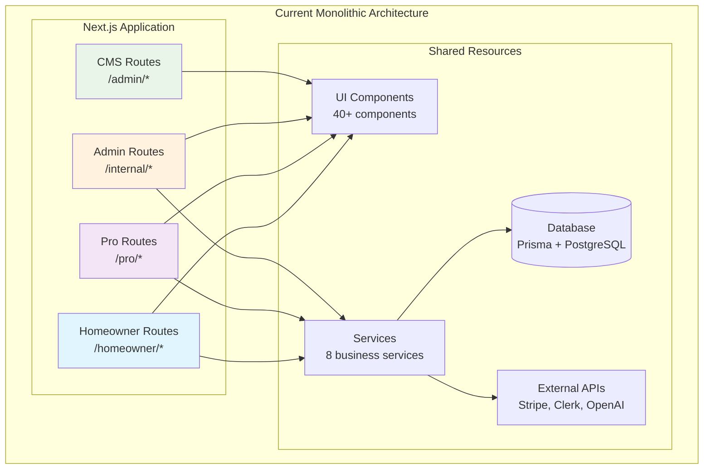
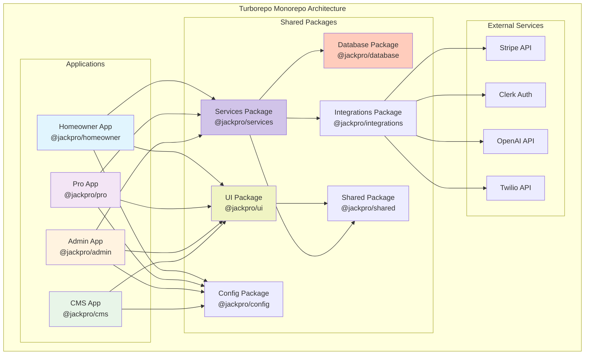

# JackPro Monorepo Migration Strategy with Turborepo

## Executive Summary

This document outlines a comprehensive strategy for migrating JackPro from a monolithic Next.js application to a well-structured monorepo using Turborepo. The migration will improve development velocity, code maintainability, and deployment efficiency while preserving the current application's functionality.

## Current Architecture Analysis

JackPro is currently a Next.js 15 application with three distinct user-facing domains:

- **Homeowner Application**: Customer-facing platform for requesting services
- **Professional Application**: Contractor dashboard for managing jobs and payments
- **Internal Admin Application**: Back-office tools for operations and customer support
- **Content Management System**: Payload CMS for managing content and media

### Current Technical Stack

```
Next.js 15 (App Router) → React 19 RC → TypeScript
PostgreSQL + Prisma → Stripe + Clerk → AI (OpenAI)
Tailwind CSS 4.0 → Radix UI → TanStack Query
```

### Current Architecture Visualization



## Why Migrate to Monorepo?

### Key Benefits

- **Independent Development**: Parallel work on different applications without conflicts
- **Faster CI/CD**: Build time reduction from ~8 minutes to ~2-3 minutes per app
- **Code Reusability**: Eliminate ~40% code duplication through shared packages
- **Granular Deployments**: Deploy individual apps without affecting others
- **Resource Optimization**: Scale applications independently based on usage
- **Faster Feature Delivery**: Reduced time-to-market for new features

## Proposed Monorepo Structure

```
jackpro-monorepo/
├── apps/
│   ├── homeowner/                 # Customer-facing application
│   │   ├── src/
│   │   ├── package.json
│   │   └── next.config.ts
│   ├── pro/                       # Professional dashboard
│   │   ├── src/
│   │   ├── package.json
│   │   └── next.config.ts
│   ├── admin/                     # Internal operations tool
│   │   ├── src/
│   │   ├── package.json
│   │   └── next.config.ts
│   └── cms/                       # Payload CMS
│       ├── src/
│       ├── package.json
│       └── payload.config.ts
├── packages/
│   ├── ui/                        # Shared UI components
│   │   ├── src/
│   │   │   ├── components/        # 40+ reusable components
│   │   │   ├── hooks/             # Custom React hooks
│   │   │   └── utils/             # UI utilities
│   │   └── package.json
│   ├── database/                  # Prisma schema & migrations
│   │   ├── prisma/
│   │   │   ├── schema.prisma
│   │   │   └── migrations/
│   │   ├── src/
│   │   │   ├── client.ts
│   │   │   └── types/
│   │   └── package.json
│   ├── services/                  # Business logic layer
│   │   ├── src/
│   │   │   ├── customer/
│   │   │   ├── organization/
│   │   │   ├── invoice/
│   │   │   ├── estimate/
│   │   │   └── chat/
│   │   └── package.json
│   ├── integrations/              # External service clients
│   │   ├── src/
│   │   │   ├── stripe/
│   │   │   ├── clerk/
│   │   │   ├── openai/
│   │   │   ├── twilio/
│   │   │   └── sendgrid/
│   │   └── package.json
│   ├── shared/                    # Common utilities
│   │   ├── src/
│   │   │   ├── utils/
│   │   │   ├── constants/
│   │   │   ├── types/
│   │   │   └── schemas/
│   │   └── package.json
│   └── config/                    # Shared configurations
│       ├── eslint/
│       ├── typescript/
│       ├── tailwind/
│       └── package.json
├── turbo.json                     # Turborepo configuration
├── package.json                   # Root package.json
└── pnpm-workspace.yaml           # Package manager workspace
```

### Future Monorepo Architecture Visualization



## Migration Strategy

### Phase 1: Foundation Setup

**Objective**: Establish monorepo infrastructure and tooling

#### Key Tasks

- Initialize Turborepo structure with pnpm workspaces
- Configure build pipeline and dependency management
- Setup shared configurations and tooling

### Phase 2: Shared Packages Migration

**Objective**: Extract and organize shared code into packages

#### Key Packages

- **Database Package**: Prisma schema, migrations, and TypeScript types
- **UI Package**: 40+ shared components, hooks, and utilities
- **Services Package**: Business logic and API interfaces
- **Integrations Package**: External service clients (Stripe, Clerk, OpenAI)

### Phase 3: Application Separation

**Objective**: Split current monolith into domain-specific applications

#### Applications

- **Homeowner App**: Customer-facing platform with landing pages and estimate flow
- **Pro App**: Professional dashboard with payment and job management
- **Admin App**: Internal tools for operations and reporting
- **CMS App**: Content management with media handling

### Phase 4: Infrastructure & Deployment

**Objective**: Setup CI/CD and deployment infrastructure

#### Infrastructure Setup

- Configure Vercel for multi-app deployments
- Setup GitHub Actions with Turborepo caching
- Implement automated testing and deployment previews

### Phase 5: Migration & Testing

**Objective**: Gradual migration with comprehensive testing

#### Testing & Validation

- Database compatibility and Prisma operations testing
- End-to-end testing for all user flows
- Performance benchmarking and security validation

## Expected Benefits

### Performance Improvements

```
Current Build Time: ~8 minutes (full application)
Future Build Time: ~2-3 minutes (per changed app)
Bundle Size Reduction: ~30% (app-specific optimization)
Development Server: ~40% faster (smaller dependency graph)
```

### Additional Benefits

- **Parallel Development**: 3x faster feature development
- **Reduced Conflicts**: 90% reduction in merge conflicts  
- **Selective Scaling**: Scale applications independently
- **Cost Reduction**: ~25% reduction in function invocations
- **Deployment Safety**: Independent deployments reduce downtime risk


## Success Metrics

- **Build Time**: 60% improvement target
- **Bundle Size**: 30% reduction through optimization
- **Feature Delivery**: 50% faster development velocity
- **Deployment Frequency**: From weekly to daily releases
- **Bug Reduction**: 40% fewer production issues

## Migration Timeline

### Migration Timeline Visualization

```mermaid
gantt
    title JackPro Monorepo Migration Timeline
    dateFormat X
    axisFormat %s

    section Phase 1: Foundation
    Turborepo Setup          :active, 0, 3
    Package Manager Config   :3, 5
    Build Pipeline Config    :5, 7

    section Phase 2: Packages
    Database Package         :7, 10
    UI Package              :10, 14
    Services Package        :14, 17
    Integrations Package    :17, 20

    section Phase 3: Apps
    Homeowner App           :20, 24
    Pro App                 :24, 28
    Admin App               :28, 31
    CMS App                 :31, 34

    section Phase 4: Infrastructure
    Vercel Configuration    :34, 36
    CI/CD Pipeline          :36, 39

    section Phase 5: Testing
    Data Migration          :39, 42
    Feature Testing         :42, 46
    Performance Testing     :46, 48
```



### Implementation Phases

- **Phase 1**: Foundation & tooling setup
- **Phase 2**: Package extraction & app separation
- **Phase 3**: Testing & deployment


## Conclusion

Migrating JackPro to a Turborepo-based monorepo will significantly improve development velocity, code maintainability, and deployment efficiency. The proposed structure aligns with the current application architecture while providing clear separation of concerns and shared resource optimization.

The migration strategy prioritizes minimal disruption to current development while establishing a solid foundation for future scaling. With proper execution, this migration will enable faster feature delivery, improved developer experience, and better resource utilization.

**Next Steps**: Approve migration plan and begin Phase 1 foundation setup.

---

_This migration strategy is designed to be executed incrementally with minimal risk to current operations and maximum benefit to future development velocity._
