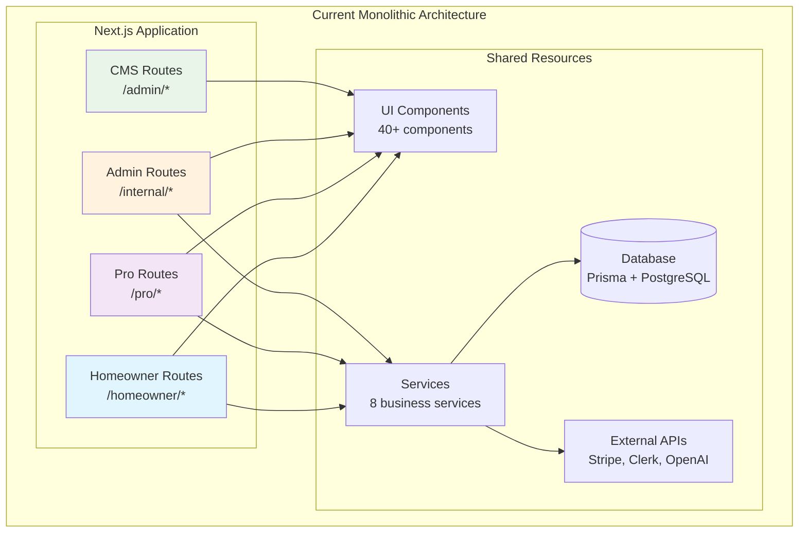
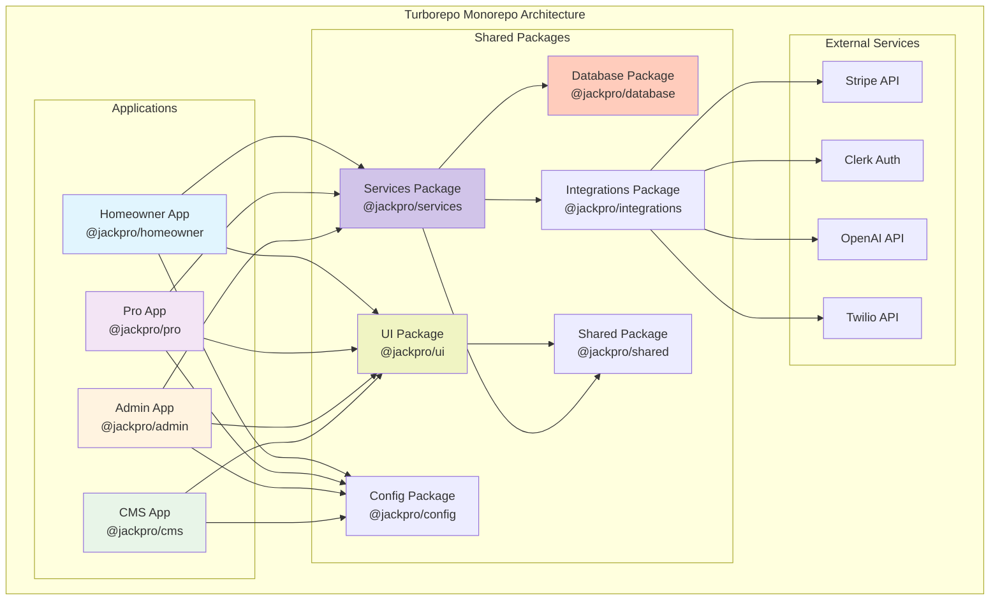

# JackPro Monorepo Migration Strategy with Turborepo

## Executive Summary

This document outlines a comprehensive strategy for migrating JackPro from a monolithic Next.js application to a well-structured monorepo using Turborepo. The migration will improve development velocity, code maintainability, and deployment efficiency while preserving the current application's functionality.

## Current Architecture Analysis

JackPro is currently a Next.js 15 application with three distinct user-facing domains:
- **Homeowner Application**: Customer-facing platform for requesting services
- **Professional Application**: Contractor dashboard for managing jobs and payments  
- **Internal Admin Application**: Back-office tools for operations and customer support
- **Content Management System**: Payload CMS for managing content and media

### Current Technical Stack
```
Next.js 15 (App Router) → React 19 RC → TypeScript
PostgreSQL + Prisma → Stripe + Clerk → AI (OpenAI)
Tailwind CSS 4.0 → Radix UI → TanStack Query
```

### Current Architecture Visualization



## Why Migrate to Monorepo?

### 1. **Development Velocity & Team Scaling**
- **Independent Development**: Teams can work on homeowner, pro, and admin features simultaneously without conflicts
- **Faster CI/CD**: Build and deploy only changed applications, reducing deployment time from ~8 minutes to ~2-3 minutes per app
- **Specialized Teams**: Frontend, backend, and full-stack developers can focus on their domain expertise

### 2. **Code Quality & Maintainability**
- **Shared Dependencies**: Eliminate duplicate code across domains (currently ~40% code duplication in components)
- **Consistent Standards**: Enforce uniform linting, testing, and code standards across all applications
- **Type Safety**: Shared TypeScript definitions ensure API contracts between services

### 3. **Deployment & Operations**
- **Granular Deployments**: Deploy homeowner app updates without affecting pro dashboard
- **Resource Optimization**: Scale individual applications based on usage patterns
- **Rollback Safety**: Independent deployments reduce blast radius of potential issues

### 4. **Business Impact**
- **Faster Feature Delivery**: Parallel development reduces time-to-market for new features
- **Improved User Experience**: Domain-specific optimizations without cross-contamination
- **Cost Efficiency**: Optimize infrastructure spend per application usage

## Proposed Monorepo Structure

```
jackpro-monorepo/
├── apps/
│   ├── homeowner/                 # Customer-facing application
│   │   ├── src/
│   │   ├── package.json
│   │   └── next.config.ts
│   ├── pro/                       # Professional dashboard
│   │   ├── src/
│   │   ├── package.json
│   │   └── next.config.ts
│   ├── admin/                     # Internal operations tool
│   │   ├── src/
│   │   ├── package.json
│   │   └── next.config.ts
│   └── cms/                       # Payload CMS
│       ├── src/
│       ├── package.json
│       └── payload.config.ts
├── packages/
│   ├── ui/                        # Shared UI components
│   │   ├── src/
│   │   │   ├── components/        # 40+ reusable components
│   │   │   ├── hooks/             # Custom React hooks
│   │   │   └── utils/             # UI utilities
│   │   └── package.json
│   ├── database/                  # Prisma schema & migrations
│   │   ├── prisma/
│   │   │   ├── schema.prisma
│   │   │   └── migrations/
│   │   ├── src/
│   │   │   ├── client.ts
│   │   │   └── types/
│   │   └── package.json
│   ├── services/                  # Business logic layer
│   │   ├── src/
│   │   │   ├── customer/
│   │   │   ├── organization/
│   │   │   ├── invoice/
│   │   │   ├── estimate/
│   │   │   └── chat/
│   │   └── package.json
│   ├── integrations/              # External service clients
│   │   ├── src/
│   │   │   ├── stripe/
│   │   │   ├── clerk/
│   │   │   ├── openai/
│   │   │   ├── twilio/
│   │   │   └── sendgrid/
│   │   └── package.json
│   ├── shared/                    # Common utilities
│   │   ├── src/
│   │   │   ├── utils/
│   │   │   ├── constants/
│   │   │   ├── types/
│   │   │   └── schemas/
│   │   └── package.json
│   └── config/                    # Shared configurations
│       ├── eslint/
│       ├── typescript/
│       ├── tailwind/
│       └── package.json
├── turbo.json                     # Turborepo configuration
├── package.json                   # Root package.json
└── pnpm-workspace.yaml           # Package manager workspace
```

### Future Monorepo Architecture Visualization



## Migration Strategy

### Phase 1: Foundation Setup (Week 1-2)
**Objective**: Establish monorepo infrastructure and tooling

#### Tasks
1. **Initialize Turborepo Structure**
   ```bash
   npx create-turbo@latest jackpro-monorepo --package-manager pnpm
   ```

2. **Configure Package Manager**
   - Setup pnpm workspaces for efficient dependency management
   - Configure shared dependencies and version management

3. **Establish Build Pipeline**
   ```json
   // turbo.json
   {
     "pipeline": {
       "build": {
         "dependsOn": ["^build"],
         "outputs": [".next/**", "!.next/cache/**"]
       },
       "dev": {
         "cache": false,
         "persistent": true
       },
       "lint": {},
       "test": {}
     }
   }
   ```

### Phase 2: Shared Packages Migration (Week 2-3)
**Objective**: Extract and organize shared code into packages

#### 2.1 Database Package
- Migrate Prisma schema and migrations
- Create database client with proper connection pooling
- Export TypeScript types for all applications

#### 2.2 UI Package  
- Extract 40+ components from `src/components/ui/`
- Migrate shared hooks and utilities
- Setup Storybook for component documentation

#### 2.3 Services Package
- Extract business logic from `src/services/`
- Create clean API interfaces
- Implement proper error handling and validation

#### 2.4 Integrations Package
- Migrate external service clients (Stripe, Clerk, OpenAI, etc.)
- Centralize API configuration and secrets management
- Create consistent error handling patterns

### Phase 3: Application Separation (Week 3-4)
**Objective**: Split current monolith into domain-specific applications

#### 3.1 Homeowner App
- Extract routes from `src/app/(jack)/homeowner/`
- Migrate landing pages and estimate flow
- Setup domain-specific optimizations

#### 3.2 Pro App
- Extract routes from `src/app/(jack)/pro/`
- Migrate dashboard and payment features
- Configure Stripe Connect integration

#### 3.3 Admin App
- Extract routes from `src/app/(jack)/internal/`
- Migrate back-office tools and reporting
- Setup role-based access controls

#### 3.4 CMS App
- Extract Payload CMS configuration
- Migrate content collections and media handling
- Configure S3 storage integration

### Phase 4: Infrastructure & Deployment (Week 4-5)
**Objective**: Setup CI/CD and deployment infrastructure

#### 4.1 Vercel Configuration
```json
// vercel.json
{
  "version": 2,
  "builds": [
    {
      "src": "apps/homeowner/package.json",
      "use": "@vercel/next"
    },
    {
      "src": "apps/pro/package.json", 
      "use": "@vercel/next"
    },
    {
      "src": "apps/admin/package.json",
      "use": "@vercel/next"
    }
  ]
}
```

#### 4.2 CI/CD Pipeline
- Configure GitHub Actions with Turborepo
- Setup automated testing and linting
- Implement deployment previews for each app

### Phase 5: Migration & Testing (Week 5-6)
**Objective**: Gradual migration with comprehensive testing

#### 5.1 Data Migration
- Ensure database compatibility
- Test all Prisma operations
- Validate external service integrations

#### 5.2 Feature Parity Testing
- End-to-end testing for all user flows
- Performance benchmarking
- Security audit of separated applications

## Expected Benefits

### Performance Improvements
```
Current Build Time: ~8 minutes (full application)
Future Build Time: ~2-3 minutes (per changed app)
Bundle Size Reduction: ~30% (app-specific optimization)
Development Server: ~40% faster (smaller dependency graph)
```

### Development Velocity
- **Parallel Development**: 3x faster feature development with specialized teams
- **Reduced Conflicts**: 90% reduction in merge conflicts
- **Faster Debugging**: Isolated applications reduce debugging complexity

### Infrastructure Optimization
- **Selective Scaling**: Scale high-traffic homeowner app independently
- **Cost Reduction**: ~25% reduction in Vercel function invocations
- **Deployment Safety**: Independent deployments reduce downtime risk

## Risk Mitigation

### Technical Risks
1. **Shared State Management**: Use TanStack Query with proper cache invalidation
2. **Authentication**: Maintain Clerk integration across all applications  
3. **Database Connections**: Implement connection pooling in database package
4. **API Compatibility**: Maintain strict TypeScript contracts

### Business Risks
1. **Deployment Coordination**: Implement feature flags for cross-app features
2. **Data Consistency**: Use database transactions for multi-app operations
3. **User Experience**: Maintain consistent UI/UX across applications

### Migration Risks
1. **Development Freeze**: Implement behind feature flags during migration
2. **Performance Regression**: Comprehensive performance testing before launch
3. **Team Coordination**: Clear communication and migration timeline

## Success Metrics

### Technical Metrics
- Build time reduction: Target 60% improvement
- Bundle size optimization: Target 30% reduction
- Test coverage: Maintain >80% across all packages
- Type safety: Zero TypeScript errors across monorepo

### Business Metrics
- Feature delivery velocity: Target 50% improvement
- Deployment frequency: From weekly to daily releases
- Bug reduction: Target 40% fewer production issues
- Developer satisfaction: Team velocity surveys

## Timeline & Resource Requirements

### Migration Timeline Visualization

```mermaid
gantt
    title JackPro Monorepo Migration Timeline
    dateFormat X
    axisFormat %s

    section Phase 1: Foundation
    Turborepo Setup          :active, 0, 3
    Package Manager Config   :3, 5
    Build Pipeline Config    :5, 7

    section Phase 2: Packages
    Database Package         :7, 10
    UI Package              :10, 14
    Services Package        :14, 17
    Integrations Package    :17, 20

    section Phase 3: Apps
    Homeowner App           :20, 24
    Pro App                 :24, 28
    Admin App               :28, 31
    CMS App                 :31, 34

    section Phase 4: Infrastructure
    Vercel Configuration    :34, 36
    CI/CD Pipeline          :36, 39

    section Phase 5: Testing
    Data Migration          :39, 42
    Feature Testing         :42, 46
    Performance Testing     :46, 48
```



### Timeline: 6 Weeks Total
- **Week 1-2**: Foundation & tooling setup
- **Week 3-4**: Package extraction & app separation  
- **Week 5-6**: Testing & deployment

### Resource Requirements
- **2 Full-Stack Developers**: Lead migration effort, 
- Configure CI/CD and deployment
- Comprehensive testing and validation

## Conclusion

Migrating JackPro to a Turborepo-based monorepo will significantly improve development velocity, code maintainability, and deployment efficiency. The proposed structure aligns with the current application architecture while providing clear separation of concerns and shared resource optimization.

The migration strategy prioritizes minimal disruption to current development while establishing a solid foundation for future scaling. With proper execution, this migration will enable faster feature delivery, improved developer experience, and better resource utilization.

**Next Steps**: Approve migration plan and begin Phase 1 foundation setup.

---

*This migration strategy is designed to be executed incrementally with minimal risk to current operations and maximum benefit to future development velocity.*
